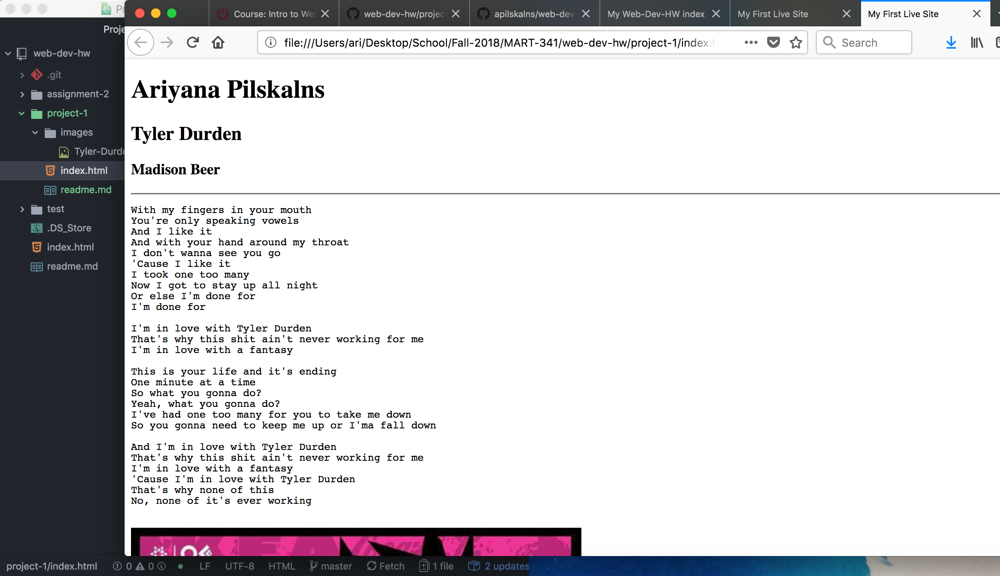

## Read Me

### 1. Browsers

I have always used firfox for the most part as my default browser, but since I have started working as a web designer and using a pc instead of a mac for work, I have been using Chrome. I still prefer to use firfox but they both work fairly well.

### 2. Wayback Mahine
I have only ever used the wayback machine for entertainment purposes but more recently I have used it to compare websites and designs. This is especially helpful for designers to show differences when the old page no longer exists.

### 3. Work Cycle
This work cycle was easy but I enjoyed the refresher in html and github.

### 4. Image 

