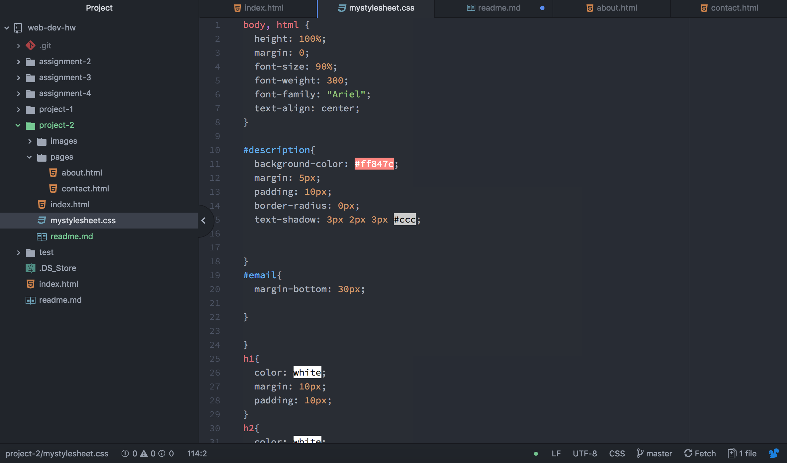

## Ariyana Pilsklans
# Project 2

I particularly liked going over the technical structure of a website and figuring out the building blocks in which it has been built. The HTML of a site is really the skeleton and the CSS is the flesh. I’m really looking forward to fleshing out my ideas and designs even further with CSS in the next module

This work cycle was a bit of a pain. I couln't figure out why my css wasn't affecting all my pages. It happened to be one period that I had b=missed when linking the pages. I was so excited when I figured it out. I jumped up and might have possibly yelled for joy.

